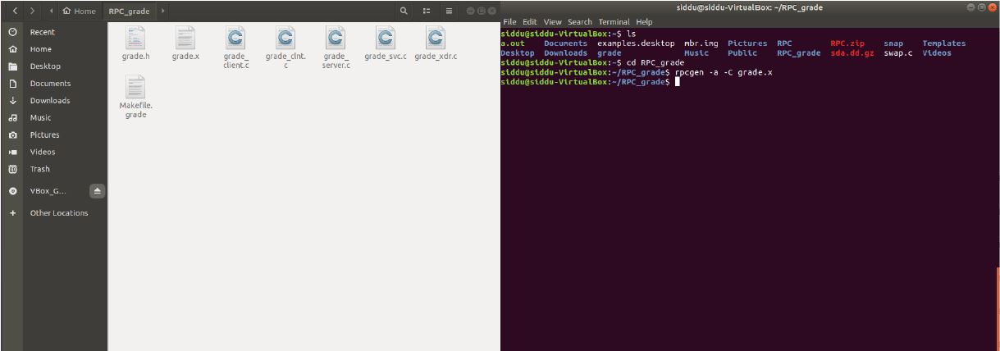
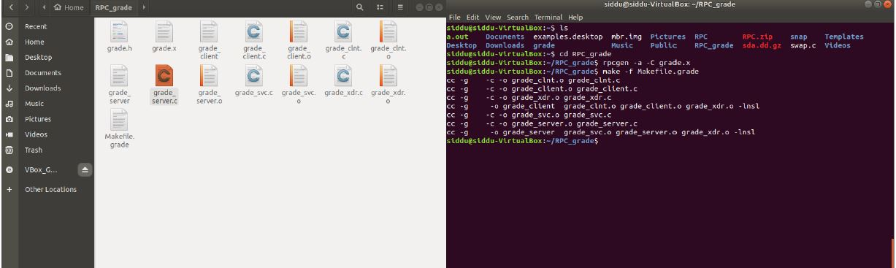
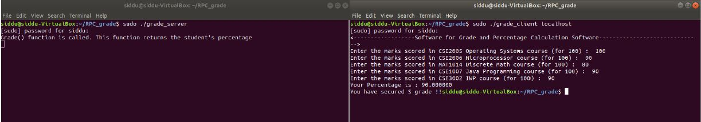

# :1234: Student-Grading-System-using-RPC
A real time scenario where a student enter his WIN-SEM marks for five subjects and then request the Server to compute the grade and percentage he/she gets based on his/her marks. I have also implemented basic mathematical operations like subtraction and factorial where the result is computed by the server.

## Motivation
* RPC(*Remote Procedure Call*) method helps clients to communicate with servers by the conventional use of procedure calls in high-level languages.
* RPC method is modeled on the local procedure call, but the called procedure is most likely to be executed in a different process and usually a different computer.
* RPC provides abstraction. For example, the message-passing nature of network communication remains hidden from the user.
* RPC allows the usage of the applications in a distributed environment that is not only in the local environment.
* Once the IP address of server is provided, client can execute complex methods which are taking more space to execute and get result from server. By doing this *code redundancy* is reduced and many clients can interact with same server to execute the same method present in server and get their wanted results back. 
* Reduces *space complexity* as one method stored in one place i.e, server method can be executed by large number of clients.

## Language/Tools used
- [x] Ubuntu 14.04.6 LTS
- [x] C
- [x] RPCGEN
- [x] Oracle VM VirtualBox

## Installation:
1. Download ubuntu version 14.04.6 LTS and install on your VM VirtualBox.
2. Type `sudo apt-get install rpcbind ` in your ubuntu terminal.
3. Locate the RPC folder and paste the grade.x file.
4. Navigate to the RPC folder in terminal and type `rpcgen -a -C grade.x` to compile the above file.
5. Type `make -f Makefile.grade` to compile the newly created files and to generate additional files(server and the client ones).
6. Open another terminal and type `sudo ./grade_server` to start the server and type `sudo ./grade_client localhost` on the other.
7. The above steps can be followed for the ***subtraction*** and ***factorial*** too.
8. Input the mark values for each subject where these ***parameter*** values are passed and calls the remote method.
9. The result is returned by the server method and the result is printed on the *client side*.
## Tests
* Compiling the ***X file***.

* Execution of ***make file*** command

* ***Result***

## Challenges
1. **RPC Runtime**: RPC run-time system is a library of routines and a set of services that handle the network communications that underlie the RPC mechanism. In the course of an RPC call, client-side and server-side run-time systems’ code handle binding, establish communications over an appropriate protocol, pass call data between the client and server, and handle communications errors.
2. **Binding**: How does the client know who to call, and where the service resides?

## Thanks
***[Jay Kishor Pal](https://www.linkedin.com/in/jay-kishor-pal-57105217a/)***
 
